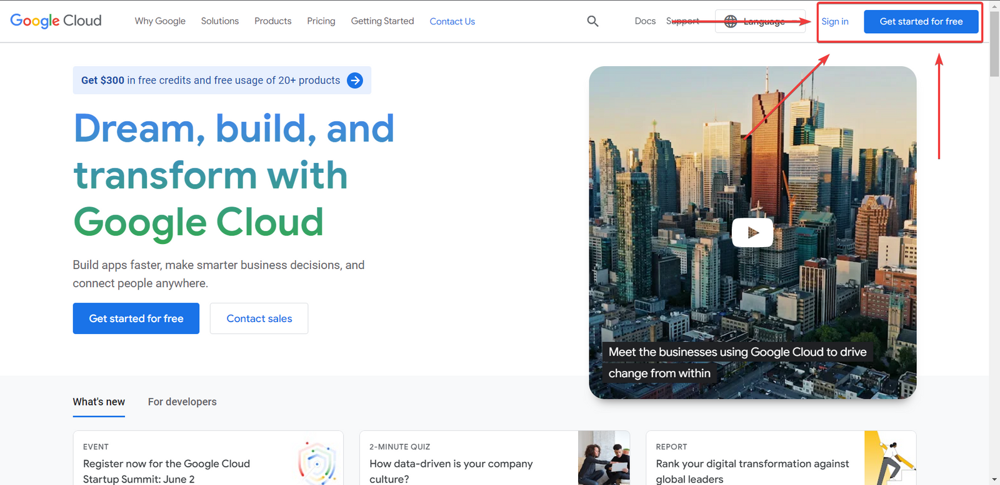
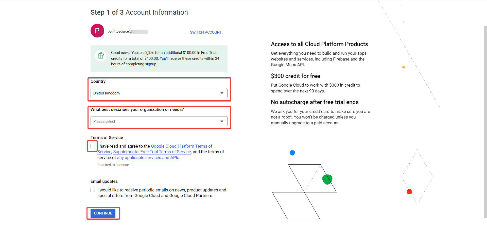
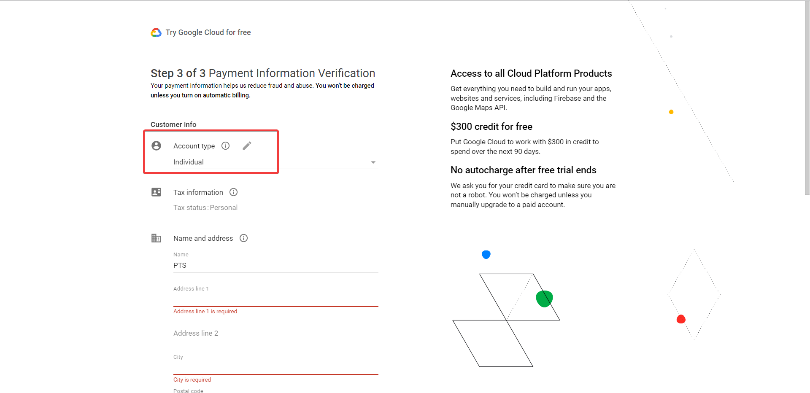
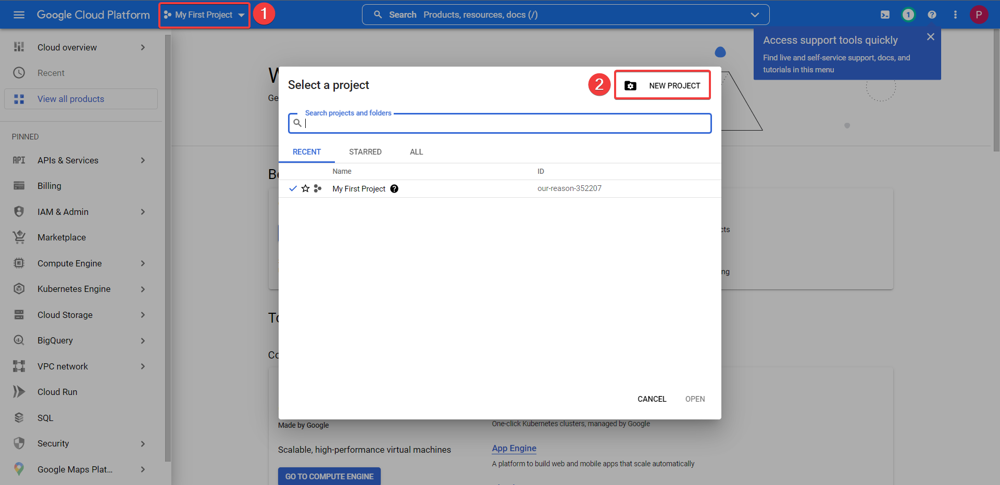

#:material-google-cloud: Google Cloud Platform - Deploys an Ubuntu Minimal OS Virtual Machine with Docker-ce and Docker Compose installed using Terraform:material-terraform:


!!! tip "My Github Repo For This Project"
    [My Github Link - Joeharrison94 / terraform-gcp-ubuntu-container-ready-e2-micro-vm](https://github.com/Joeharrison94/terraform-gcp-ubuntu-container-ready-e2-micro-vm)

Using the below instructions and supplied files in the repo, you will be able to deploy an e2-micro instance into GCP via :material-terraform: Terraform. This is the free forever tier so it shouldn't cost you a thing.

This version comes with :fontawesome-brands-docker: docker & docker compose pre-installed. It will also inject a compose file into the app data drive in `/mnt/disks/docker/projects/app` my example contains an Uptime Kuma and Healthchecks container.

Before you continue make sure that you have your :material-gmail: Gmail account credentials handy as you will need them to setup the Google Cloud account.
****
## Google Cloud Platform Account Registration
Firstly you should understand what exactly you are sigining up for, we are making this account to gain access to the GCP (Google Cloud Platform), in order to make a free forever VPS / VM you can read more on the offerings [here](https://cloud.google.com/free/docs/gcp-free-tier).

<figure markdown>
  { width=1000 }
  <figcaption>Navigate to https://cloud.google.com and press the "Get started for free" button</figcaption>
</figure>

<figure markdown>
  { width=1000 }
  <figcaption>Sign in if prompted. This part is country dependant, you shoud provide your mobile number for SMS verification</figcaption>
</figure>

<figure markdown>
  { width=1000 }
  <figcaption>Fill the form in, ensuring that the "Account type" is "Individual". Ignore the next few pop-ups that ask you to try products which are billable</figcaption>
</figure>

<figure markdown>
  { width=1000 }
  <figcaption>When you arrive at the home page, select the 'My First Project` dropdown in the upper left. Select 'NEW PROJECT'</figcaption>
</figure>

<figure markdown>
  { width=1000 }
  <figcaption>Name the project this can be anything you want, a project ID will automatically assigned. Click CREATE to finalize youe new project</figcaption>
</figure>

<figure markdown>
  { width=1000 }
  <figcaption>When the green tick appears next to your new project it is ready, click 'SELECT PROJECT'</figcaption>
</figure>

<figure markdown>
  { width=1000 }
  <figcaption>You are taken to the project dashboard, from here select the 'Compute Engine', then enable it on the page it opens. This can take a minute or two to fully enable so please be patient</figcaption>
</figure>

## Google Shell API & VPS Deployment Prep

<figure markdown>
  { width=1000 }
  <figcaption>Now that the Compute Engine is enabled, press the gshell icon in the upper right corner, this will load you into a Google Cloud Shell</figcaption>
</figure>

<figure markdown>
  { width=1000 }
  <figcaption>You will be automatically placed in your users home directory '/home/[USER]'. Copy the commands below to setup the dirs you'll need for the Terraform deployment</figcaption>
</figure>

=== ":material-bash: bash"
    ``` bash
    cd ~/ && mkdir terraform compose_files .ssh startup auth && ls
    ```
<figure markdown>
  { width=1000 }
  <figcaption>You should now see all the directories listed here</figcaption>
</figure>

Now it is time to clone my GitHub Repo into the `terraform` folder.

=== ":material-bash: bash"
    ``` bash
    cd terraform && git clone https://github.com/Joeharrison94/terraform-gcp-ubuntu-container-ready-e2-micro-vm
    ```
<figure markdown>
  { width=1000 }
  <figcaption>This is the output of the clone, following this we need to shuffle some of the files around to different folders. Using the 'Open Editor' in the upper right corner of the shell window</figcaption>
</figure>

<figure markdown>
  { width=1000 }
  <figcaption>I have listed all the files and paths you need to change below to make it easier to read</figcaption>
</figure>

All of the files are currently in the `./terraform` folder to move them into the correct folder all you need to do is drag and drop them individually.
!!! tldr "File Locations"
    - [x] `docker-compose.yaml` :material-file-code: :arrow_right: :arrow_right: `./compose_files` :file_folder:
    - [x] `startup.sh` :material-file-code: :arrow_right: :arrow_right: `./startup` :file_folder:
    - [x] `*.tf` :material-terraform: :arrow_right: :arrow_right:  `./terraform` :file_folder:

    === ":material-bash: Folder Structure"
    ``` sh
    .                                                                                             
    ├─ auth/                               # Folder to store the API user credentials             
    ├─ compose_files/                                                                             
    │  └─ docker-compose.yaml              # Docker compose configuration file                    
    ├─ startup/                                                                                   
    │  └─ startup.sh                       # Startup script to install dependancies               
    └─ terraform/                                                                                 
       ├─ network-firewall.tf              # Network Firewall Rule Definitions                    
       ├─ network-main.tf                  # Network Definitions                                  
       ├─ network-variables.tf             # Network Terraform Variable Definitions               
       ├─ provider-main.tf                 # GCP Providers Definitions                            
       ├─ provider-variables.tf            # GCP Providers Terraform Variable Definitions         
       ├─ terraform.tfvars                 # Terraform Variable Definitions                       
       ├─ ubnt-versions.tf                 # Ubuntu Version Definitions                           
       ├─ ubnt-vm-main.tf                  # Main VM Configuration Definitions                    
       ├─ ubnt-vm-output.tf                # Information To Display When Provisioning Completes   
       └─ ubnt-vm-variables.tf             # Main VM Terraform Variable Definitions               
    ```
Now to edit the `.tf` and `.tfvars` files inside the `./terraform` folder. I'm not going to go through them all as they explain what needs altering fairly well, but some pointers:

!!! tip 
    `IDENTIFIER` must be changed in `NETWORK-FIREWALL` and `NETWORK-MAIN` files - it doesn't matter what you change it to, but keep it short and the same.

    The `terraform.tfvars` requires your `project ID` , `project name` , and for you to change the `user`. This user should be your email address without the @gmail.com, where `me@gmail.com` becomes `me`.

!!! caution    
    Do not change the `GCP region` or `zone` as the ones selected are in the free forever locations, if you change these you may incur costs.

<figure markdown>
  { width=1000 }
  <figcaption>Example modification of `terraform.tfvars`</figcaption>
</figure>

## API User Setup
Navigate back to or reopen your Google Cloud Shell terminal.

We will now create the SSH keys that you will use to access the VM once it is deployed. Changing the part in [ ] to something else, this is the comment.
=== ":material-bash: bash"
    ``` bash
    cd ~/
    ssh-keygen -t ed25519 -f ~/.ssh/sshkey -C [KeysForVPSAccess]
    ```
Follow the on-screen instructions and do not set a passphrase, when asked leave it blank and press enter.

When this process completes, you will have `sshkey` and `sshkey.pub` in your `/home/user/.ssh` folder.

<figure markdown>
  { width=1000 }
  <figcaption>Output of the aforementioned SSH keypair creation process</figcaption>
</figure>

We need to create a service account to use Terraform :material-terraform: with and give it all the required permissions necessary to provision the VM.

!!! warning "You may need to authorize the API the first time you run one of the below commands"

=== ":material-bash: bash"
    ``` bash
    # Run all these commands individually and ensure each one completes before moving onto the next one

    ##~~~~~~~~~~~~~~~~~~~~~~~~~~~~~~~~~~~~~~~~~~~~~~~~~~~~~~~~~~~~~~##
    ## Ensure that you update PROJECT-ID-HERE with your project ID. ##
    ##~~~~~~~~~~~~~~~~~~~~~~~~~~~~~~~~~~~~~~~~~~~~~~~~~~~~~~~~~~~~~~##
    
    # Change working directory to the users home folder
    cd ~/

    # Creates a service account named tf-serviceaccount 
    gcloud iam service-accounts create tf-serviceaccount --description="service account for terraform" --display-name="terraform_service_account"

    # List accounts to ensure it was created
    gcloud iam service-accounts list

    # Create keys for the service account to use when provisioning and store them in the auth folder.
    gcloud iam service-accounts keys create ~/auth/google-key.json --iam-account tf-serviceaccount@PROJECT-ID-HERE.iam.gserviceaccount.com
    ```

With this done we will now add the following permissions to the service account.
=== ":material-bash: bash"
    ``` bash
    # Run all these commands individually and ensure each one completes before moving onto the next one

    ##~~~~~~~~~~~~~~~~~~~~~~~~~~~~~~~~~~~~~~~~~~~~~~~~~~~~~~~~~~~~~~##
    ## Ensure that you update PROJECT-ID-HERE with your project ID. ##
    ##~~~~~~~~~~~~~~~~~~~~~~~~~~~~~~~~~~~~~~~~~~~~~~~~~~~~~~~~~~~~~~##

    gcloud services enable cloudresourcemanager.googleapis.com

    gcloud services enable cloudbilling.googleapis.com

    gcloud services enable iam.googleapis.com

    gcloud services enable storage.googleapis.com

    gcloud services enable serviceusage.googleapis.com

    gcloud projects add-iam-policy-binding PROJECT-ID-HERE --member serviceAccount:tf-serviceaccount@PROJECT-ID-HERE.iam.gserviceaccount.com --role roles/viewer

    gcloud projects add-iam-policy-binding PROJECT-ID-HERE --member serviceAccount:tf-serviceaccount@PROJECT-ID-HERE.iam.gserviceaccount.com --role roles/storage.admin

    gcloud projects add-iam-policy-binding PROJECT-ID-HERE --member serviceAccount:tf-serviceaccount@PROJECT-ID-HERE.iam.gserviceaccount.com --role roles/compute.instanceAdmin.v1

    gcloud projects add-iam-policy-binding PROJECT-ID-HERE --member serviceAccount:tf-serviceaccount@PROJECT-ID-HERE.iam.gserviceaccount.com --role roles/compute.networkAdmin

    gcloud projects add-iam-policy-binding PROJECT-ID-HERE --member serviceAccount:tf-serviceaccount@PROJECT-ID-HERE.iam.gserviceaccount.com --role roles/compute.securityAdmin
    ```
## VPS / VM Deployment
Now that we have created the service account you can now use Terraform :material-terraform: to create the VM.

=== ":material-bash: bash"
    ``` bash
    cd ~/terraform
    terraform init
    ```
<figure markdown>
  { width=1000 }
  <figcaption>Terraform Initialization</figcaption>
</figure>

If the init returns with no errors, then we can move onto the `plan` stage.

=== ":material-bash: bash"
    ``` bash
    terraform plan
    ```
When prompted type a name for your VM, type in anything you want but keep it simple.

If the plan returns with no errors, we can move onto the final stage where it will apply the config. When you proceed ensure that you type in the same VM name that you entered in the plan stage. Finally when prompted type 'yes' then hit enter to deploy your VM.

=== ":material-bash: bash"
    ``` bash
    terraform apply
    ```

<figure markdown>
  { width=1000 }
  <figcaption>Terraform Applying</figcaption>
</figure>

The full deployment and configuration will take some time to complete fully, but if everything was configured according to this guide, your screen should show that 7 resources have been added without fault.

Head back to your `Compute Engine`, and check out `VM Instances`, your VM will be ready and waiting.
<figure markdown>
  { width=1000 }
  <figcaption>Behold Your VM</figcaption>
</figure>

!!! caution 
    An important thing to note, is that as part of the `startup.sh` script it will install and configure docker & docker compose and inject the compose file. 

    Because of this I would give the VM time to complete all the actions it needs to before you login, 5-10 minutes should be ample time.

Now click the `SSH` button this will prompt a browser window, and after injecting the SSH keys (takes a while, so don't worry), it will successfully connect to the VM.

<figure markdown>
  { width=1000 }
  <figcaption>Accessing The VM</figcaption>
</figure>

!!! Tip "Quick Note"
    You can use the private key `~/.ssh/sshkey` to SSH into the machine using the public IP remotely, you can see the IP displayed in your Terraform outputs.

## Docker Containers - Uptime Kuma & Healthschecks!
Navigate to the directory `/mnt/disks/docker/projects/app` `ls` the directory to find the injected `docker-compose.yaml` :material-file-code:

=== ":material-bash: bash"
    ``` bash
    cd /mnt/disks/docker/projects/app
    ls
    ```
??? question "My docker-compose.yaml file is missing? Click Here"
    If for some reason the docker-compose.yaml hasn't been injected after 15 minutes of VM uptime for whatever reason. 
    Create it with the below commands.

    === ":material-bash: bash"
    ``` bash
    cd /mnt/disks/docker/projects/app

    sudo touch docker-compose.yaml

    # After the below command runs it will open the empy file, copy in the contents of the file from my GitHub repo, save it then exit with 'CTRL + S' then 'CTRL + X'
    sudo nano docker-compose.yaml 
    ```
Navigate to the docker folder, then create the folders below and spin up the docker containers.

=== ":material-bash: bash"
    ``` bash
    cd /mnt/disks/docker

    sudo mkdir uptime-kuma healthchecks

    # Option 1
    sudo docker compose -f /mnt/disks/docker/projects/app/docker-compose.yaml up -d

    # Option 2
    # You can either add your user to the 'docker' user group so you dont have to use sudo to run docker commands, or just use sudo
    sudo usermod -aG docker $USER
    docker compose -f /mnt/disks/docker/projects/app/docker-compose.yaml up -d
    ```
Check that your containers up and running.
=== ":material-bash: bash"
    ``` bash
    sudo docker ps # Or just 'docker ps' if you added your user to the 'docker' user group
    ```
<figure markdown>
  { width=1000 }
  <figcaption>Checking The Docker Containers</figcaption>
</figure>

Your containers are now running and functional!

##Setting The Public Firewall
But now you need to access them, access for now will be via the public IP and the port. Right now it will not work as you have now rules to allow it.

Take note of the uptime-kuma port (3001). 

Head over to the VM page (we no longer require te cloud terminal, close it if you so wish).

<figure markdown>
  { width=1000 }
  <figcaption>Opening The Firewall</figcaption>
</figure>

Click the button `Set up firewall rules` then `CREATE FIREWALL RULE` at the top of the page. Follow the onscreen prompts adding a rule name, network information and port.

<figure markdown>
  { width=1000 }
  <figcaption>Setting The Firewall</figcaption>
</figure>

Take note of the external IP of your VM in the `VM instances` screen, in a new browser tab navigate to http://EXTERNALIP:3001

This will take you to your Uptime Kuma service!

<figure markdown>
  { width=1000 }
  <figcaption>First Time Setup Screen - Uptime Kuma</figcaption>
</figure>

!!! note "Final Note"
    By Default Google sets the VM networking to premium, so dont forget to go and change it to standard, as shown here.

    

Congratulations! You've got access to your Uptime-Kuma instance!, you can also follow the same steps with regards to the Healthchecks container.

!!! success
    CONGRATULATIONS! You have successfully deployed a Google Cloud Platform VM with functional docker containers using Terraform!
    
However this method of access is not secure at all as anyone can access you service if they have the IP and port of your VM not to mention it is plain text HTTP a BIG no no. We need HTTPS This is where Cloudflare and their awesome suite of security tools save the day. I have a seperate guide that runs through all of this which I will link to in the section below.

Thanks for reading and happy home labbing!

##Setting Up A Cloudflared Argo Tunnel With Zero Trust!

[Cloudflared Argo Tunnels with Zero Trust!](cloudflared.md)

## Links
An honourable mention to :fontawesome-brands-reddit-alien: `u/BackedUpBooty` for supplying me with all the screenshots I used for this guide and for the lovely writeup he gave me that inspired me to improve my doc's for this project [Link to the blog post here!](https://academy.pointtosource.com/general/service-monitoring/).
